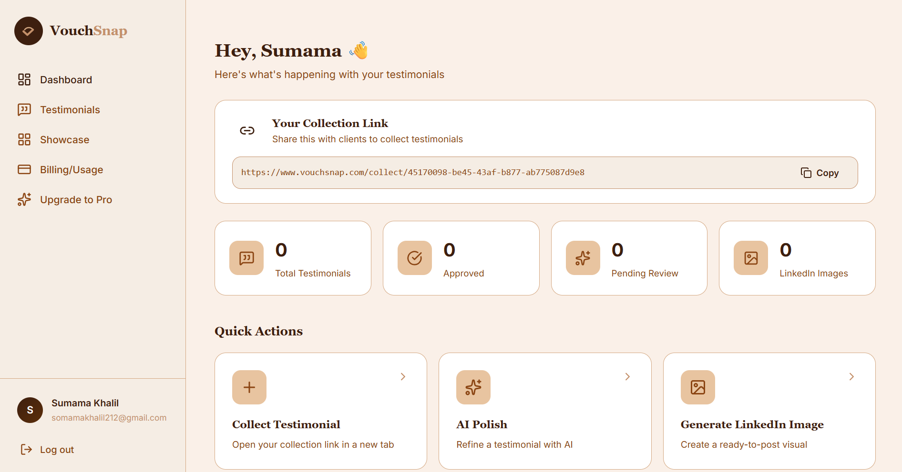
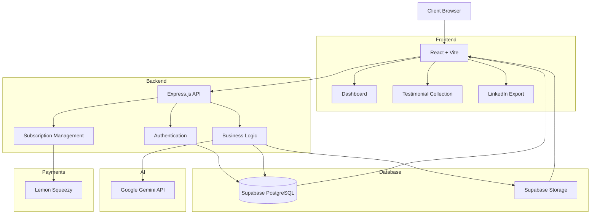
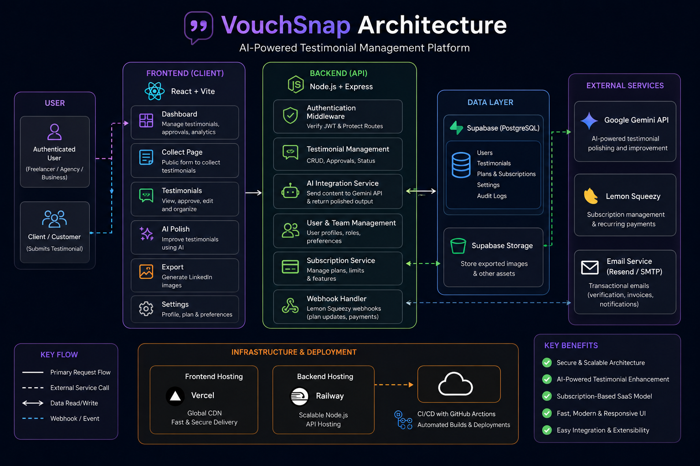

# VouchSnap

An AI-powered SaaS platform that helps freelancers, agencies, and businesses collect, manage, polish, and showcase client testimonials through AI-assisted workflows, embeddable widgets, and social media exports.

## Table of Contents

- [Overview](#overview)
- [Live Demo](#live-demo)
- [Screenshots](#screenshots)
- [System Architecture](#system-architecture)
- [Tech Stack](#tech-stack)
- [Key Features](#key-features)
- [Engineering Highlights](#engineering-highlights)
- [Technical Challenges](#technical-challenges)
- [What I Learned](#what-i-learned)
- [Future Improvements](#future-improvements)
- [Contact](#contact)

## Overview

VouchSnap is a modern AI-powered SaaS platform designed to help freelancers, agencies, and businesses effortlessly collect, manage, and showcase client testimonials.

Instead of manually requesting reviews and formatting them for marketing, VouchSnap automates the entire workflow—from collecting feedback through a public link to polishing testimonials with AI, exporting branded social media graphics, and embedding testimonials directly into websites.

The platform follows a production-ready SaaS architecture with secure authentication, subscription management, role-based access, AI integration, and scalable cloud infrastructure.

---

## Live Demo

Website: wwww.vouchsnap.com

---

## Screenshots

### Dashboard

## System Architecture

### Architecture Diagram

## Tech Stack

| Category | Technologies |
|-----------|--------------|
| Frontend | React.js, Vite, React Router, JavaScript (ES6), Custom CSS |
| Backend | Node.js, Express.js (REST API) |
| Database | Supabase PostgreSQL |
| Authentication | Supabase Auth, Row-Level Security (RLS) |
| Storage | Supabase Storage |
| AI | Google Gemini API |
| Payments | Lemon Squeezy |
| Deployment | Vercel (Frontend), Railway (Backend) |
| Image Export | html-to-image |
| Version Control | Git & GitHub |

## Key Features

- AI-powered testimonial polishing using Google Gemini.
- Public testimonial collection page with no login required for clients.
- Secure user authentication with Supabase Auth.
- Testimonial management dashboard with approval workflow.
- One-click LinkedIn image generation for social media sharing.
- Embeddable testimonial widgets for websites and portfolios.
- Subscription-based SaaS model powered by Lemon Squeezy.
- Free and Pro user plans with feature gating.
- Responsive dashboard optimized for desktop and mobile.
- Secure PostgreSQL database with Row-Level Security.

## Engineering Highlights

### AI-Assisted Workflow

Integrated Google Gemini to automatically rewrite client testimonials into professional, marketing-ready content while preserving the original meaning and tone.

### Secure Authentication

Implemented Supabase Authentication with Row-Level Security (RLS) to ensure every user can only access their own testimonials and account data.

### SaaS Subscription Architecture

Designed a subscription system using Lemon Squeezy webhooks, enabling automatic plan upgrades, feature gating, and scalable recurring billing.

### Social Media Export Engine

Built a client-side export pipeline that converts approved testimonials into beautifully branded LinkedIn-ready images using html-to-image.

### Embeddable Widgets

Developed reusable HTML embed snippets that allow customers to display approved testimonials directly on their websites without exposing backend infrastructure.

### Production-Oriented Architecture

Separated frontend and backend responsibilities using React + Vite for the client application and Express.js REST APIs for business logic, improving scalability and maintainability.

## Technical Challenges

### Secure Public Submission Flow

Designed a workflow where clients can submit testimonials without authentication while ensuring malicious requests cannot compromise user data.

### AI Response Handling

Implemented validation and fallback logic to handle inconsistent AI-generated outputs while maintaining a reliable user experience.

### Subscription Synchronization

Integrated Lemon Squeezy webhooks with backend APIs to keep subscription status synchronized across the application.

### Database Security

Configured Supabase Row-Level Security policies to protect sensitive user information while allowing efficient data access.

### Image Export Optimization

Optimized html-to-image rendering to generate high-quality social media graphics while preserving responsive layouts and branding.

## What I Learned

Building VouchSnap strengthened my experience in designing production-ready SaaS applications by combining frontend engineering, backend APIs, AI services, authentication, payments, and cloud infrastructure into a cohesive product.

Key takeaways include:

- Designing scalable REST APIs.
- Implementing secure authentication and authorization.
- Working with PostgreSQL and Row-Level Security.
- Integrating external AI services into production workflows.
- Building subscription-based SaaS products.
- Creating reusable frontend components.
- Managing full-stack deployments across multiple cloud providers.

## Future Improvements

- Multi-language testimonial support.
- AI-generated testimonial summaries.
- Team workspaces for agencies.
- Analytics dashboard for testimonial performance.
- Custom branding and white-label exports.
- Video testimonial collection.
- Zapier and Make.com integrations.
- Public API for third-party integrations.

## Contact

If you'd like to discuss this project or collaborate on AI-powered SaaS products, feel free to connect.

- LinkedIn: www.linkedin.com/in/muhammad-sumama-khalil
- Email: somamakhalil212@gmail.com

