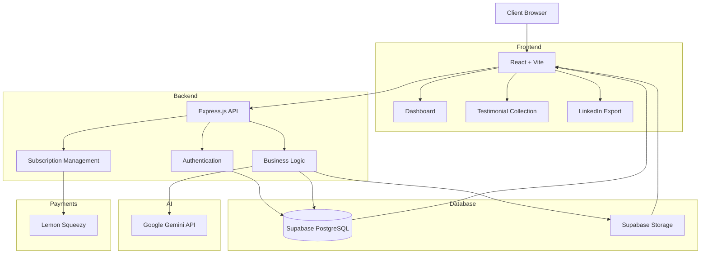

# VouchSnap

An AI-powered SaaS platform that helps freelancers, agencies, and businesses collect, manage, polish, and showcase client testimonials through AI-assisted workflows, embeddable widgets, and social media exports.

## Table of Contents

- [Overview](#overview)
- [Live Demo](#live-demo)
- [Screenshots](#screenshots)
- [System Architecture](#system-architecture)
- [Tech Stack](#tech-stack)
- [Key Features](#key-features)
- [Engineering Highlights](#engineering-highlights)
- [Technical Challenges](#technical-challenges)
- [What I Learned](#what-i-learned)
- [Future Improvements](#future-improvements)
- [Contact](#contact)

## Overview

VouchSnap is a modern AI-powered SaaS platform designed to help freelancers, agencies, and businesses effortlessly collect, manage, and showcase client testimonials.

Instead of manually requesting reviews and formatting them for marketing, VouchSnap automates the entire workflow—from collecting feedback through a public link to polishing testimonials with AI, exporting branded social media graphics, and embedding testimonials directly into websites.

The platform follows a production-ready SaaS architecture with secure authentication, subscription management, role-based access, AI integration, and scalable cloud infrastructure.

---

## Live Demo

**Coming Soon**

---

## Screenshots

### Dashboard

## System Architecture

### Architecture Diagram

